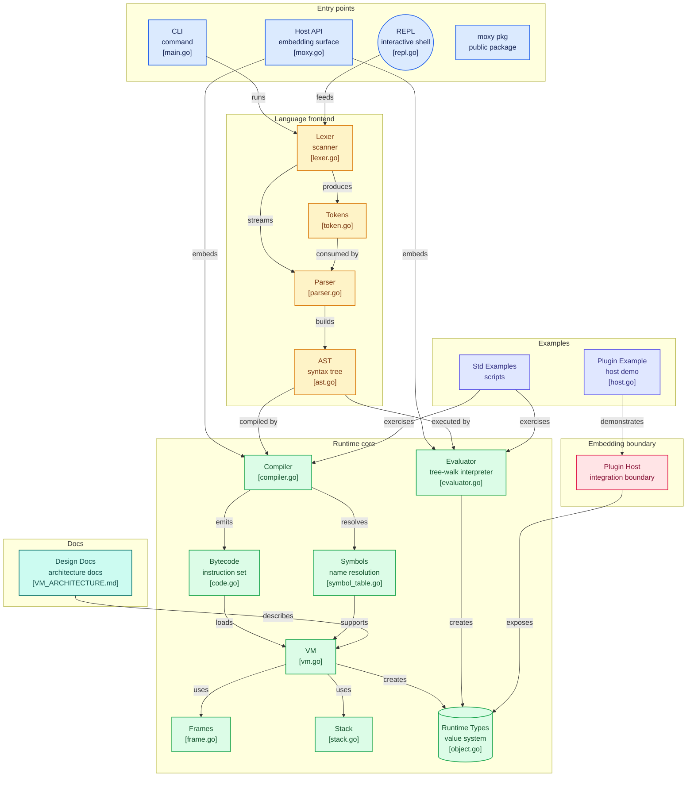

# 🪨 Moxy

**The Scripting Language Go Developers Already Know.**

Moxy is a high-performance, sandboxed scripting language designed specifically for embedding in Go applications. It combines the simplicity of Go with the flexibility of a dynamic scripting engine.

---

## 🚀 Why Moxy?

If you are a Go developer, you've likely faced the "scripting dilemma":
*   **Lua** is fast but has `1-based` indexing and non-Go syntax.
*   **Starlark** is safe but restrictive (no recursion) and Python-based.
*   **Embedded Go** is powerful but complex to sandbox and heavy.

**Moxy** bridges this gap by providing a **Go-native VM** that uses a syntax you already know.

### Core Value Proposition
- **Go-Like Syntax**: `func`, `var`, `:=`, and `0-based` indexing.
- **Fast Bytecode VM**: Compiles to bytecode for high performance without JIT overhead.
- **Pure Go**: Zero-dependency embedding. No CGO.
- **Safely Sandboxed**: Controlled execution environment for plugins and rules engines.

---

## 🛠 Usage

### In your Go project
```go
import "github.com/yourusername/moxy/package/vm"
import "github.com/yourusername/moxy/package/compiler"

func main() {
    p := parser.New(lexer.New("x := 10; return x + 5;"))
    prog := p.ParseProgram()
    
    comp := compiler.New()
    bytecode := comp.Compile(prog)
    
    machine := vm.New(bytecode)
    machine.Run()
    
    result := machine.LastPoppedStackElem()
    fmt.Println(result) // 15
}
```

### CLI
```bash
./moxy examples/demo.pb
```

---

## 📋 Language Specification (v1.0)

| Feature | Syntax |
|---------|--------|
| **Variables** | `var x = 1` or `x := 1` |
| **Functions** | `func add(a, b) { return a + b }` |
| **Loops** | `while condition { ... }` (Go-style `for` coming soon) |
| **Conditions**| `if x > 10 { ... } else { ... }` |
| **Data Types**| `int`, `string`, `bool`, `array`, `map` |

---

## 🌟 Practical Examples

### 1. Business Rule Engine
```go
// discount_rules.pb
func calculate_discount(order) {
    if order.total > 500 {
        return order.total * 0.1 // 10% off
    }
    return 0
}
```

### 2. Plugin System
```go
// filter.pb
func process(event) {
    if event.type == "metric" && event.value < 0 {
        return null // drop invalid metrics
    }
    return event
}
```

---

## ⚖️ Comparison

| | Moxy | Lua | Starlark |
|---|---|---|---|
| **Syntax** | **Go** | Pascal/C | Python |
| **Indexing** | **0-based** | 1-based | 0-based |
| **Implementation** | **Pure Go** | C (GopherLua is Go) | Go/Java |
| **Performance** | **High** | Extreme (C) | Moderate |

---

## Architecture Diagram


---
## 🛤 Roadmap

1.  **Phase 1 (Current)**: VM and Bytecode foundations.
2.  **Phase 2**: Standardize syntax (`func` and `:=` enforcement).
3.  **Phase 3**: Standard library (JSON, Math, Time).
4.  **Phase 4**: Concurrency-lite (channels and fibers).

---

## 🤝 Contributing

We are in early development! Feel free to open issues or PRs. Read our [CONTRIBUTING.md](CONTRIBUTING.md) to get started.
